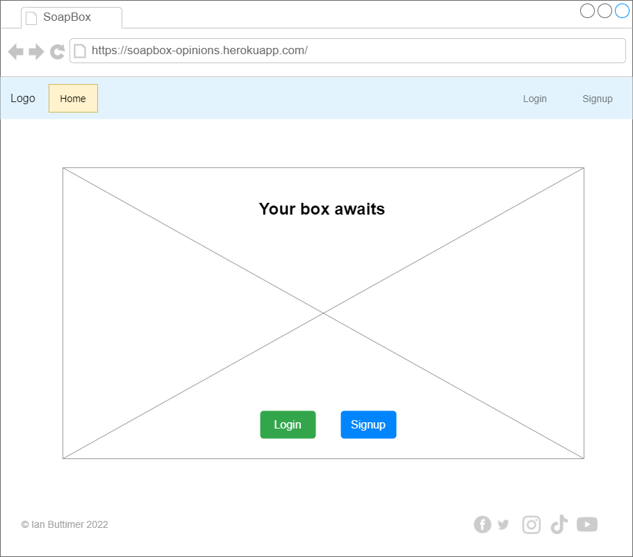
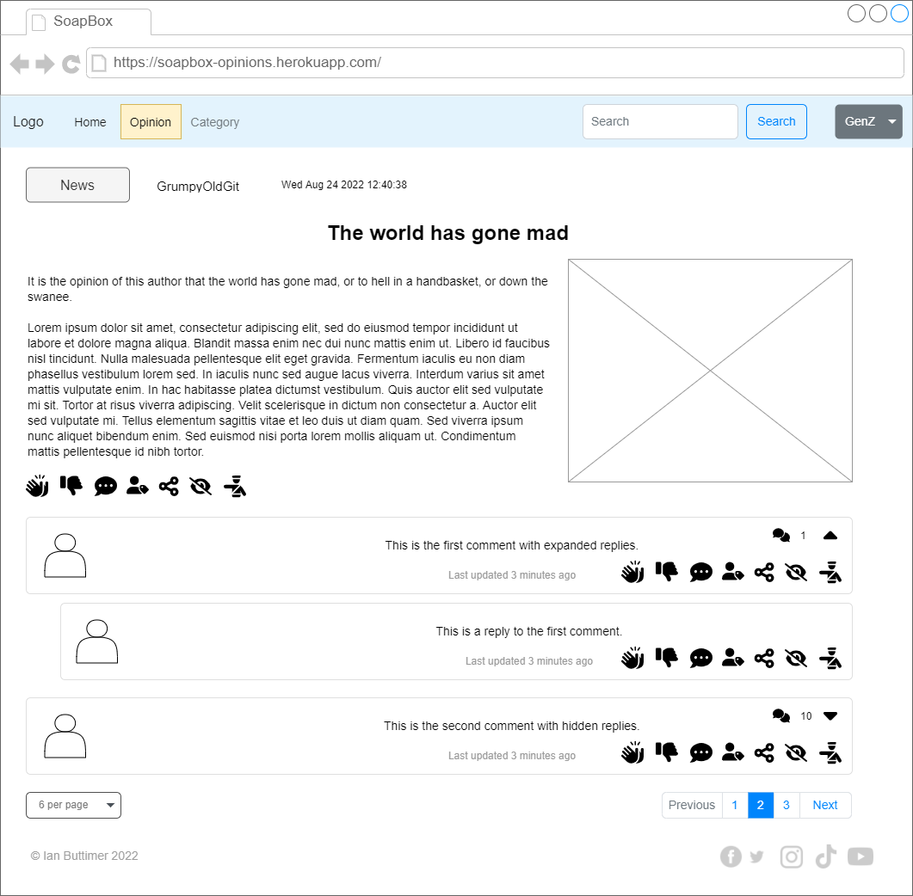
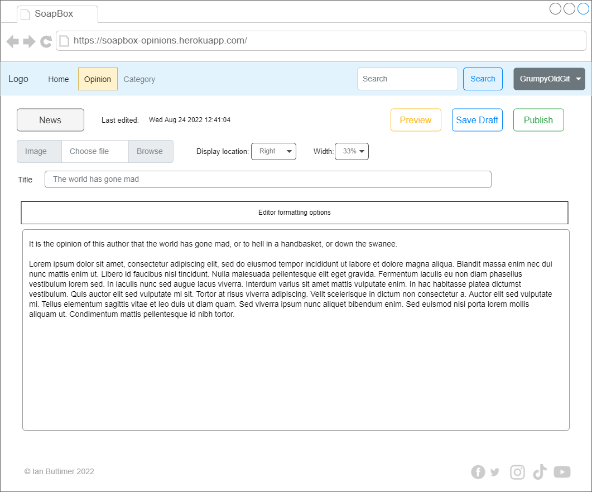

# Strategy
The strategy is to create a website allowing the user to post opinions and comment on opinions posted by other users.

The target audience for the application are people wishing to express opinions and engage in online debate.

# Scope
The scope of the project will be to allow the user to:
- Login and logout
- Depending on role, create and view or just view, opinions and comments
- Depending on role, like/unlike/report, opinions and comments
- Follow and unfollow other users
- Depending on role, delete previously created opinions

## User Stories/Objectives

User Stores are logged in [GitHub Issues](https://github.com/ibuttimer/soapbox/labels/userstory)

| Title                                                                                         | Labels | Description |
|-----------------------------------------------------------------------------------------------|--------|-------------|
| [User Story: Login](https://github.com/ibuttimer/soapbox/issues/1)                            | `userstory`, `kanban` | As a **user**, I can **login**, so that **I can access the site**. |
| [User Story: Register user](https://github.com/ibuttimer/soapbox/issues/2)                    | `userstory`, `kanban` | As a **user**, I can **register**, so that **I can access the site**. |
| [User Story: Create opinion](https://github.com/ibuttimer/soapbox/issues/3)                   | `userstory`, `kanban` | As a **verified user**, I can **create an opinion**, so that **other users may view it**. |
| [User Story: View an opinion](https://github.com/ibuttimer/soapbox/issues/4)                  | `userstory`, `kanban` | As **any user**, I can **view an opinion**, so that **I can read it**. |
| [User Story: Login with social media](https://github.com/ibuttimer/soapbox/issues/5)          | `userstory`, `kanban` | As a **user**, I can **login with social media**, so that **I can access the site**. |
| [User Story: Add opinion comment](https://github.com/ibuttimer/soapbox/issues/6)              | `userstory`, `kanban` | As a **verified user**, I can **add a comment to another user's posted opinion**, so that **I can express my opinion**. |
| [User Story: Add opinion agree/disagree/hide](https://github.com/ibuttimer/soapbox/issues/7)  | `userstory`, `kanban` | As a **verified user**, I can **mark a comment as agree/disagree/hide**, so that **opinions that users agreement level with an opinions can be highlighted**. |
| [User Story: Create categories](https://github.com/ibuttimer/soapbox/issues/8)                | `userstory`, `kanban` | As a **site administrator**, I can **create a list of categories**, so that **a verified user may assign a category to an opinion**. |
| [User Story: Logout](https://github.com/ibuttimer/soapbox/issues/9)                           | `userstory`, `kanban` | As a **user**, I can **logout**, so that **I can no longer access protected areas of the site**. |
| [User Story: Follow a user](https://github.com/ibuttimer/soapbox/issues/10)                   | `userstory`, `kanban` | As a **user**, I can **follow another user**, so that **I receive a notification when they post a new opinion**. |
| [User Story: Unfollow a user](https://github.com/ibuttimer/soapbox/issues/11)                 | `userstory`, `kanban` | As a **user**, I can **unfollow another use**, so that **I do not receive notifications when they post a new opinion**. |
| [User Story: Delete an opinion](https://github.com/ibuttimer/soapbox/issues/12)               | `userstory`, `kanban` | As a **verified user**, I can **delete an opinion I previously created**, so that **I can manage my list of opinions**. |
| [User Story: Pin opinion](https://github.com/ibuttimer/soapbox/issues/13)                     | `userstory`, `kanban` | As a **verified user**, I can **pin an opinion I previously created**, so that **it appears at the top of my list of opinions**. |
| [User Story: Unpin opinion](https://github.com/ibuttimer/soapbox/issues/14)                   | `userstory`, `kanban` | As a **verified user**, I can **unpin an opinion I previously created**, so that **it no longer appears at the top of my list of opinions**. |
| [User Story: Paginated list of opinions](https://github.com/ibuttimer/soapbox/issues/19)      | `userstory`, `kanban` | As a **user**, I can **view a paginated list of opinions**, so that **I can control the nnumber of opinions viewed at a time**. |
| [User Story: Like opinion](https://github.com/ibuttimer/soapbox/issues/20)                    | `userstory`, `kanban` | As a **verified user**, I can **like an opinion**, so that **I can provide feedback to the author**. |
| [User Story: Unlike opinion](https://github.com/ibuttimer/soapbox/issues/21)                  | `userstory`, `kanban` | As a **verified user**, I can **unlike an opinion**, so that **I can manage the list of opinions marked as liked**. |
| [User Story: Add comment comment](https://github.com/ibuttimer/soapbox/issues/22)             | `userstory`, `kanban` | As a **verified user**, I can **add a comment to another user's posted comment **, so that **I can express my opinion**. |
| [User Story: Report opinion/comment](https://github.com/ibuttimer/soapbox/issues/23)          | `userstory`, `kanban` | As a **verified user**, I can **report an opinion/comment**, so that **it may be reviewed by a moderator for objectionable content**. |
| [User Story: Approve/block opinions/comments](https://github.com/ibuttimer/soapbox/issues/24) | `userstory`, `kanban` | As a **moderator**, I can **approve/block opinions/comments that have been reported**, so that **I can prevent objectionable content from being displayed on the site**. |
| [User Story: Search](https://github.com/ibuttimer/soapbox/issues/25)                          | `userstory`, `kanban` | As a **verified user**, I can **search for opinions**, so that **I can read opinions related to the search terms I specify**. |
| [User Story: Profile](https://github.com/ibuttimer/soapbox/issues/26)                         | `userstory`, `kanban` | As a **verified user**, I can **update my profile**, so that **I can provide other users with information about myself**. |


## Objectives Implementation

# Structure
As there separate functionality will be required for users with different roles, the website will utilise a tree navigation structure.

# Skeleton
The website will consist of the following pages:

| Page            | Description                                                                                                 |
|-----------------|-------------------------------------------------------------------------------------------------------------|
| Landing         | The landing page will allow users to log in or register.                                                    |
| Home            | The home page will display the user's opinion feed, and provide shortcuts to frequently used functionality. |
| Opinion         | The opinion page will provide access to all opinion-related functionality.                                  |
| Opinion Read    | The opinion read page will allow users to view and comment on opinions.                                     |
| Opinion Compose | The opinion compose page will allow users to compose opinions.                                              |
| Opinion Preview | The opinion preview page will allow users to preview the appearance of draft opinions.                      |
| Category        | The opinion page will provide access to all category-related functionality.                                 |
| Moderator       | The moderator page will provide access to all moderator-related functionality.                              |
| Review          | The review page will allow moderators to approve or reject opinions submitted for review                    |
| Profile         | The profile page will display a user's profile and allow users to edit their own profile.                   |

# General layout

Each of the pages will have the same general layout:

- A menu at top of page, with current page highlighted in a different colour.
  The buttons will contain the appropriate text, and icons will be used to visually represent the function of each page.
- A footer at bottom of page will provide general site related information.

# Wireframes
Wireframes of page layouts are as followings:

## Landing page

The Landing page will have the following features:
- The option for users to login or register

| Large screen                        | Small screen |
|-------------------------------------|--------------|
|   | TODO         |

## Signup page

| Large screen                      | Small screen |
|-----------------------------------|--------------|
|  | TODO         |

## Login page

| Large screen                     | Small screen |
|----------------------------------|--------------|
|  | TODO         |

## Home page

The Home page will have the following features:
- Display the user's opinion feed, and provide shortcuts to frequently used functionality.

### Home page (Following)

| Large screen                               | Small screen |
|--------------------------------------------|--------------|
|   | TODO         |

### Home page (Category)

| Large screen                             | Small screen |
|------------------------------------------|--------------|
|  | TODO         |

## Opinion page

The Opinion page will have the following features:
- Allow access to all opinion functionality.

| Large screen                         | Small screen |
|--------------------------------------|--------------|
|    | TODO         |

## Opinion Read page

The Opinion Read page will have the following features:
- Allow users to view and comment on opinions.

| Large screen                      | Small screen |
|-----------------------------------|--------------|
|    | TODO         |

## Opinion Compose page

The Opinion Compose page will have the following features:
- Allow users to compose opinions.

| Large screen                        | Small screen |
|-------------------------------------|--------------|
|   | TODO         |

## Opinion Preview page

The Opinion Preview page will have the following features:
- Allow users to preview the appearance of draft opinions.

| Large screen                         | Small screen |
|--------------------------------------|--------------|
|    | TODO         |

## Category page

The Category page will have the following features:
- Allow users to access to all category-related functionality.

| Large screen                          | Small screen |
|---------------------------------------|--------------|
|    | TODO         |

## Moderator page

The Moderator page will have the following features:
- Allow users to access to all moderator-related functionality.

| Large screen                          | Small screen |
|---------------------------------------|--------------|
|    | TODO         |

## Review page

The Review page will have the following features:
- Allow moderators to approve or reject opinions submitted for review.

| Large screen                      | Small screen |
|-----------------------------------|--------------|
|  | TODO         |

## Profile page

The Profile page will have the following features:
- Allow users to view another user's profile and edit their own profile

| Large screen                         | Small screen |
|--------------------------------------|--------------|
|    | TODO         |


# UX Surface
## Font
The font used for title text will be [Rubik](https://fonts.google.com/specimen/Rubik?preview.text=SoapBox%20-%20where%20opinions%20matter&preview.text_type=custom) from Google fonts.
The font used for paragraph text will be [Barlow Condensed](https://fonts.google.com/specimen/Barlow+Condensed?preview.text=SoapBox%20-%20where%20opinions%20matter&preview.text_type=custom) from Google fonts.

```css
@import url('https://fonts.googleapis.com/css2?family=Barlow+Condensed:ital,wght@0,300;0,400;0,600;1,300;1,400;1,600&family=Rubik:ital,wght@0,400;0,700;1,400;1,700&display=swap');

font-family: 'Barlow Condensed', sans-serif;
font-family: 'Rubik', sans-serif;
```

## Colour Scheme

Colour scheme courtesy of [coolors](https://coolors.co/f8ffe5-06d6a0-1b9aaa-ef476f-ffc43d)


## UX Elements

TODO

## Accessibility
The guidelines outlined in the following will be followed:

- [W3C - Using ARIA](https://www.w3.org/TR/using-aria/)
- [TPGi - Short note on aria-label, aria-labelledby, and aria-describedby](https://www.tpgi.com/short-note-on-aria-label-aria-labelledby-and-aria-describedby/)


# Data
## Data Storage
Data will be stored in a [PostgreSQL](https://www.postgresql.org/) database.

### Database schema
The database schema will consist of several tables:

| Name             | Description                                  |
|------------------|----------------------------------------------|
 | user_contributor | site users                                   |
 | opinions         | user generated opinions                      |
 | categories       | categories to which opinions may be assigned |
 | comments         | user comments                                |
 | statuses         | statuses which may be assigned to opinions   |
 | opinion_records  | user actions on an opinion                   |
 | reviews          | opinion reviews                              |

[]

## External Libraries
The following third party libraries will be utilised:

| Library                                                                    | Use                                                               | Description                                                                                                                                                                                                               |
|----------------------------------------------------------------------------|-------------------------------------------------------------------|---------------------------------------------------------------------------------------------------------------------------------------------------------------------------------------------------------------------------|
| [django](https://pypi.org/project/psycopg2/)                               | Application framework                                             | Django is a high-level Python web framework that encourages rapid development and clean, pragmatic design.                                                                                                                |
| [psycopg2](https://pypi.org/project/psycopg2/)                             | Access PostgreSQL database                                        | This library provides a complete implementation of the Python DB API 2.0 specification. It was designed for heavily multi-threaded applications that create and destroy lots of cursors.                                  |
| [django-environ](https://pypi.org/project/django-environ/)                 | Application configuration                                         | Configuration of Django application with environment variables.                                                                                                                                                           |
| [dj3-cloudinary-storage](https://pypi.org/project/dj3-cloudinary-storage/) | Cloudinary storages for both media and static files               | Django Cloudinary Storage is a Django package that facilitates integration with Cloudinary by implementing the [Django Storage API](https://docs.djangoproject.com/en/4.1/howto/custom-file-storage/).                    |
| [django-summernote](https://pypi.org/project/django-summernote/)           | Text file editing                                                 | Make the [Summernote](https://github.com/summernote/summernote) WYSIWYG editor available to the Django admin site and Forms.                                                                                              |
| [gunicorn](https://pypi.org/project/django-summernote/)                    | Serve application on Heroku                                       | WSGI HTTP Server for UNIX                                                                                                                                                                                                 |
| _The following libraries will be used during development_                  |                                                                   |                                                                                                                                                                                                                           |
| [pycodestyle](https://pypi.org/project/pycodestyle/)                       | [PEP8](http://www.python.org/dev/peps/pep-0008/) compliance check | Python style guide checker                                                                                                                                                                                                |
| [coverage](https://pypi.org/project/pycodestyle/)                          | Code coverage testing                                             | Measures code coverage, typically during test execution. It uses the code analysis tools and tracing hooks provided in the Python standard library to determine which lines are executable, and which have been executed. |


# Errata
## 